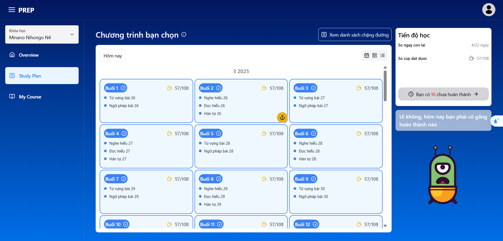

# Japanese Learning Application

## Introduction
This application helps users learn Japanese easily and effectively through lessons, vocabulary, grammar, and practice exercises.


## Features
- **Vocabulary Learning:** Themed vocabulary lists with pronunciation.
- **Grammar:** Provides grammar rules with illustrative examples.
- **Listening Practice:** Listening exercises at various difficulty levels.
- **Speaking Practice:** Pronunciation scoring using AI technology.
- **Writing Practice:** Guides for writing Kanji, Hiragana, and Katakana.
- **Quizzes:** A system of questions to help learners review their knowledge.
- **Personalization:** Tracks learning progress and suggests appropriate lessons.


## Installation Guide
1. Clone the repository:
   ```bash
   git clone https://github.com/your-repo/japanese-learning-app.git
   ```
2. Install dependencies:
   ```bash
   cd japanese-learning-app
   npm install
   ```
3. Run the application:
   ```bash
   npm run dev
   ```
4. Access the application at `http://localhost:3000`

## Technologies Used
- **Client:** React, Next.js 14, TypeScript, Tailwind CSS.
- **Server:** Express.js, Node.js.
- **Database:** MongoDB.
- **AI:** Speech recognition technology for pronunciation scoring.

## Contribution
If you would like to contribute to the project, please create a **pull request** or contact the development team via email: `support@example.com`.

## License
This application is released under the MIT license.

